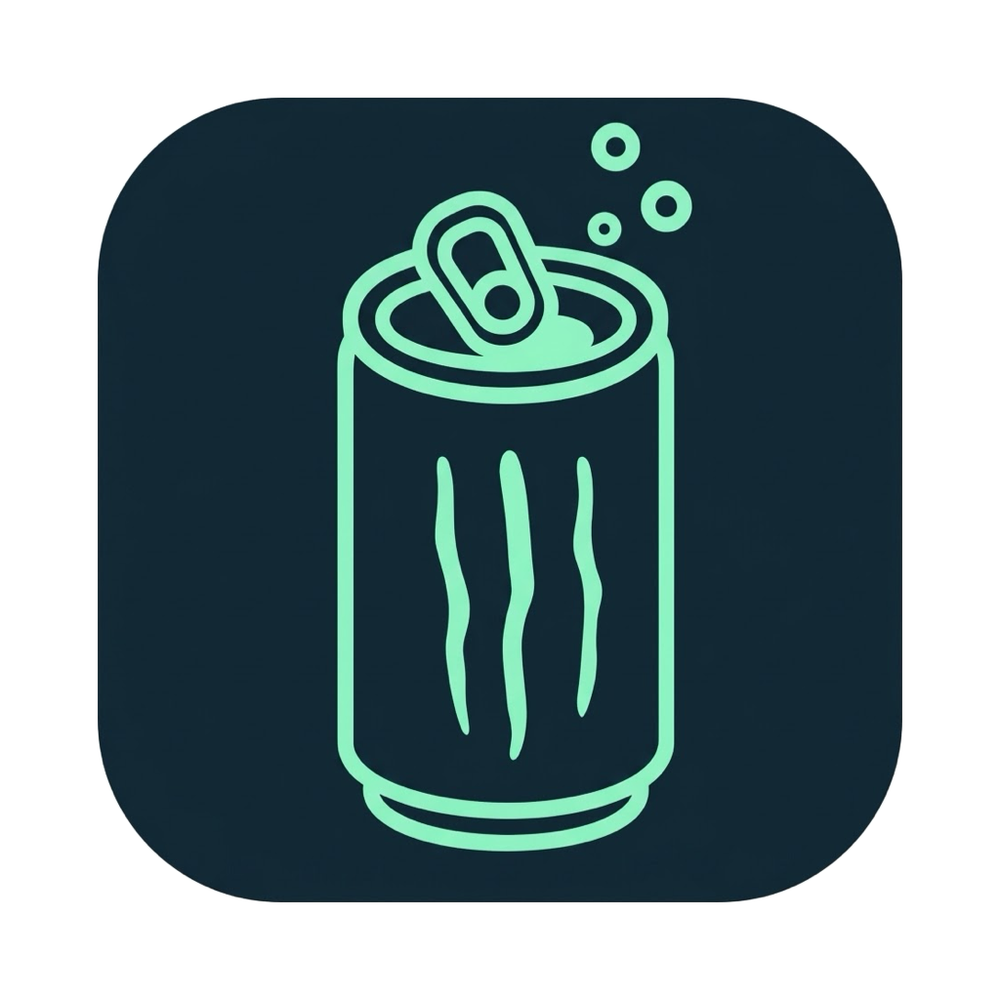

<p align="center"></p>

# Taurine

App de barra de menus para macOS que mantém o Mac acordado, inclusive com a tampa fechada. Derivado do [Caffeine](https://github.com/domzilla/Caffeine), com bloqueio de repouso via `pmset -a disablesleep` aplicado por um componente auxiliar privilegiado que restaura o repouso sozinho se o app fechar, travar ou o Mac reiniciar.

Requer macOS 14.6 ou posterior.

## Instalar

1. Baixe o `.dmg` mais recente em [Releases](https://github.com/nandoolle/taurine/releases) e arraste o Taurine para `Aplicativos`.
2. Na primeira abertura, o macOS pode bloquear o app por não ser notarizado: clique com o botão direito → **Abrir**, ou libere em *Ajustes do Sistema → Privacidade e Segurança → Abrir Mesmo Assim*.
3. Abra **Preferências** e clique em **Instalar componente auxiliar…**. É o único momento em que a senha de administrador é pedida.

Sem o componente auxiliar o Taurine não ativa: o menu apenas leva às Preferências.

## Usar

- Clique na latinha para ligar/desligar; botão direito abre o menu.
- **Ativar por** escolhe uma duração; as Preferências definem a duração padrão e a ativação ao abrir.
- **Proteção da bateria** (ligada por padrão) desliga o bloqueio quando, na bateria, a carga fica igual ou abaixo do limite (padrão 60%). Na tomada o corte não se aplica.
- **Manter apps ativos** simula atividade e pode pedir permissão de Acessibilidade.
- Um triângulo no ícone indica que o repouso precisa ser restaurado. Use **Restaurar repouso…**.

`disablesleep` é uma configuração global e persistente. O Taurine sempre restaura para `0`; não guarda um valor anterior diferente.

## Componente auxiliar

Um LaunchDaemon (`dev.taurine.helper`) roda como root e é o único que executa o `pmset`. Arquivos instalados:

- `/Library/PrivilegedHelperTools/dev.taurine.helper`
- `/Library/LaunchDaemons/dev.taurine.helper.plist`
- `/var/db/taurine/`

O app fala com ele por XPC. Quando a conexão cai (fechamento, falha, encerramento forçado, logout), o componente restaura o repouso. Em todo boot restaura o repouso incondicionalmente e, se o app tiver sido apagado, remove-se sozinho.

Para remover: Preferências → **Remover componente auxiliar…**. Manualmente, restaurando o repouso antes de tudo:

```sh
sudo pmset -a disablesleep 0
sudo launchctl bootout system/dev.taurine.helper
sudo rm -f /Library/PrivilegedHelperTools/dev.taurine.helper /Library/LaunchDaemons/dev.taurine.helper.plist
sudo rm -rf /var/db/taurine
```

## Compilar

Sem dependências externas. Com Swift 6.2 e o SDK do macOS:

```sh
./scripts/build.sh      # gera build/Taurine.app (assinatura ad hoc)
./scripts/make-dmg.sh   # gera build/Taurine-<versão>.dmg
swift test
```

Também é possível abrir `src/Taurine.xcodeproj` ou usar `./scripts/build-xcode.sh`. Os testes usam simulações do componente auxiliar, da bateria e da energia; não executam nada privilegiado.

## Créditos e licença

Baseado no Caffeine de Tomas Franzén, Michael Jones e Dominic Rodemer. Licença MIT, com os créditos originais preservados em [LICENSE](LICENSE). Histórico de versões em [CHANGELOG.md](CHANGELOG.md).
