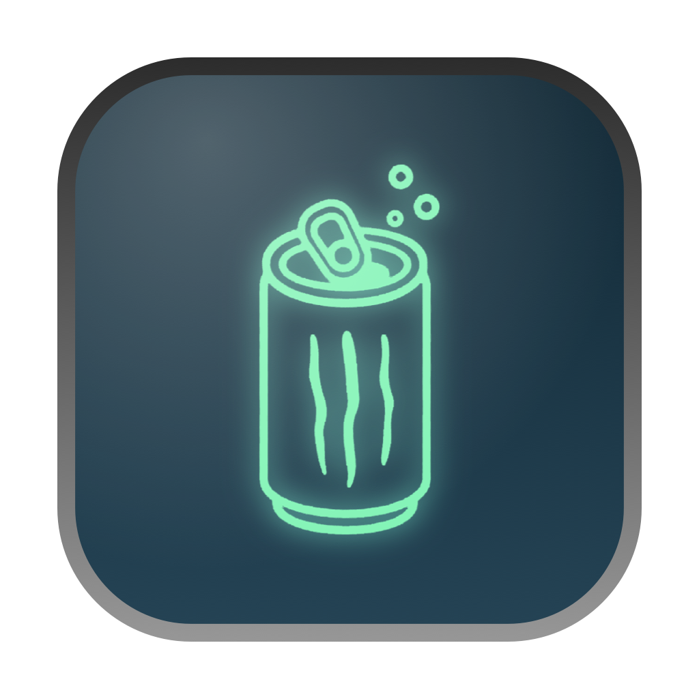
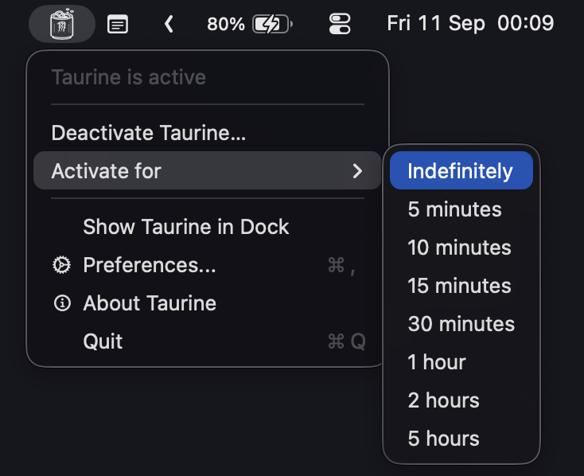
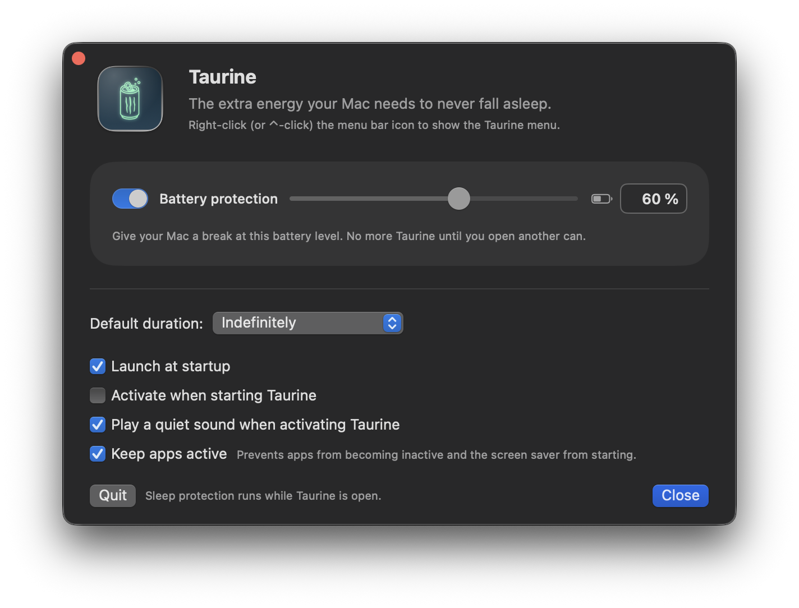

# Taurine
### Don't let your Mac fall asleep. Not even for a second.

Taurine is a tiny menu bar app that keeps your Mac awake when you need to close the lid, useful for getting into that plane without pausing claude.
Inspired by [Caffeine](https://github.com/domzilla/Caffeine), adapted for AI workflow.

Requires macOS 14.6 or later.

### Installation

Download the latest `.dmg` from [Releases](https://github.com/nandoolle/Taurine/releases), drag Taurine into your Applications folder and open it.

The app is signed with a Developer ID and notarized by Apple, so it opens normally — no Gatekeeper detours.

The first time you activate it, macOS asks for your administrator password and may ask you to enable Taurine in **System Settings → General → Login Items & Extensions**. That's once, and never again.

### Usage

Taurine puts a can in your menu bar. Click it to toggle: an open can means your Mac won't sleep, dim the screen or start the screen saver, even with the lid closed. A closed can means your Mac sleeps normally.


For more control, right-click (or ⌘-click) the icon. From there you can open Preferences or set how long Taurine should stay active.



Preferences covers the default duration, whether Taurine activates on launch, a quiet sound when it does, and **battery protection**: on battery, Taurine taps out on its own once the charge hits the level you picked (60% by default). Plugged in, it keeps going.



A triangle on the icon means sleep still needs to be restored. Use **Restore sleep…**.

### How it works

Keeping a Mac awake with the lid closed takes `pmset -a disablesleep 1`, a global, persistent setting that requires root. Taurine registers a LaunchDaemon (`dev.taurine.helper`) through `SMAppService`, and that daemon is the only thing allowed to run the command. The app talks to it over XPC.

The daemon runs from inside the app bundle — nothing is copied anywhere else on your disk.

Sleep always comes back. When the connection drops (quit, crash, force quit, logout), the daemon restores it. Every boot restores it unconditionally. And while sleep is blocked, the daemon checks every minute that the app still exists: delete Taurine — or move it to another volume — and sleep returns within a minute.

> **Edge case:** if the app is deleted while the Mac is off (say, with the disk mounted on another machine), nothing is running to restore sleep. Run `sudo pmset -a disablesleep 0`.

Versions before 0.5.0 installed files outside the bundle. Taurine removes them when you upgrade, asking for your password once to clean up and once to register the new daemon. To do it by hand:

```sh
sudo pmset -a disablesleep 0
sudo launchctl bootout system/dev.taurine.helper
sudo rm -f /Library/PrivilegedHelperTools/dev.taurine.helper /Library/LaunchDaemons/dev.taurine.helper.plist
sudo rm -rf /var/db/taurine
```

### Common question you may have

#### Why does it ask for an administrator password?

Because `disablesleep` can only be changed by root. Caffeine and similar apps use IOKit assertions, which need no password — but also can't keep a Mac awake with the lid closed. That's the trade: one password, lid-closed sleep prevention.

#### What if the Mac shuts down on a dead battery while Taurine is active?

The daemon runs on every boot and restores sleep before anything else. Close the lid and your Mac sleeps again.

#### Can I quit the app and keep the Mac awake?

No. Taurine closed means your Mac sleeps normally. That's the rule the daemon exists to guarantee.

#### Some EXTREMELY specific situation happened and now Mac never enters sleep mode! What should I do?

Keep calm, and run:

```sh
sudo pmset -a disablesleep 0
```

#### Is this a fork of Caffeine?

Basically, Yes. Caffeine is a great app that has kept Macs awake since 2006. Taurine keeps its simplicity and adds what a stronger dose needs: lid-closed sleep prevention, battery protection, and a daemon that cleans up after itself.

### Building

No external dependencies. Swift 6.2 and the macOS SDK.

`SMAppService` refuses ad hoc signatures, so a **Developer ID Application** certificate is required — local development included. Notarization isn't needed to test locally:

```sh
export TAURINE_SIGN_IDENTITY="Developer ID Application: Your Name (TEAMID)"
security find-identity -v -p codesigning   # lists available identities

./scripts/build.sh      # builds build/Taurine.app
./scripts/make-dmg.sh   # builds build/Taurine-<version>.dmg
swift test
```

When testing the daemon, always run the app from the same path: launchd indexes the registration by path and signature, so moving it between iterations leaves orphaned registrations behind. To inspect the real state:

```sh
launchctl print system/dev.taurine.helper
log show --predicate 'subsystem == "dev.taurine.helper"' --last 10m
```

You can also open `src/Taurine.xcodeproj` or use `./scripts/build-xcode.sh`.

### Credits and license

Based on Caffeine by Tomas Franzén, Michael Jones and Dominic Rodemer. MIT licensed, with the original credits preserved in [LICENSE](LICENSE). Version history in [CHANGELOG.md](CHANGELOG.md).
